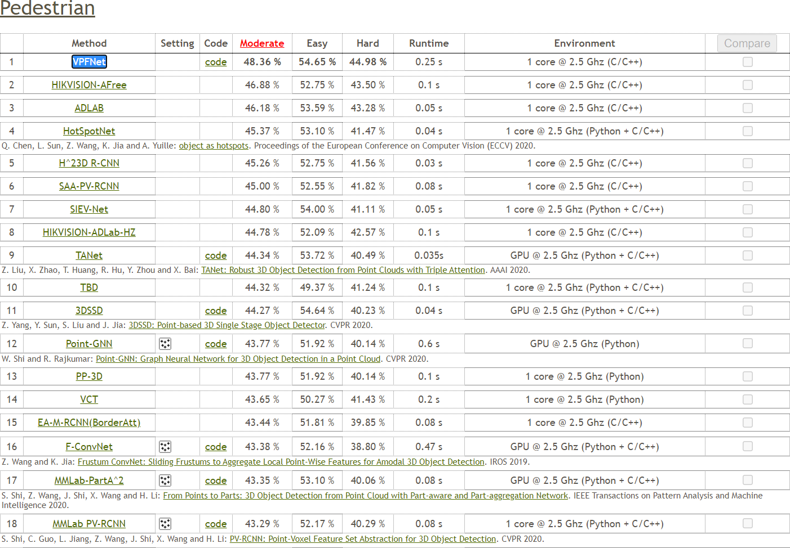
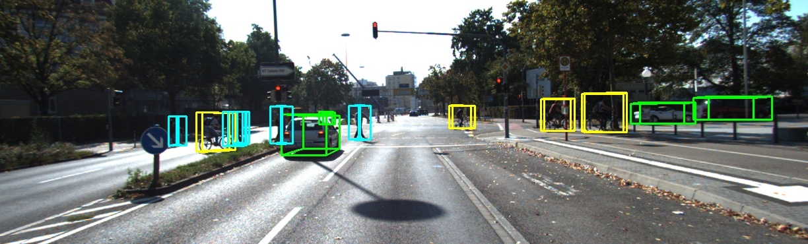

[Home](.) | [Books](books)

[LinkedIn](https://linkedin.com/in/chiahung) | "contact_AT_chiahung_DOT_wang"

## Biography

Chia-Hung obtained his B.S. in EE and B.Fin. from NTUST in 2018, followed by an M.S. in CSIE from NTU in 2021. His academic pursuits center around artificial intelligence, deep learning, and computer vision, reflecting a keen passion for advancing these fields.

## Education
- Master of Science (M.S.), [Intelligent Robot Lab](https://robotlab.csie.ntu.edu.tw), Department of Computer Science and Information Engineering ([CSIE](https://www.csie.ntu.edu.tw)), College of Electrical Engineering and Computer Science ([EECS](http://eecs.ntu.edu.tw)), National Taiwan University ([NTU](https://www.ntu.edu.tw)), 2019-09/2021-08
- Bachelor of Science (B.S.), Department of Electrical Engineering ([EE](https://www.ee.ntust.edu.tw)), College of Electrical Engineering and Computer Science ([EECS](https://www.ceecs.ntust.edu.tw)), National Taiwan University of Science and Technology ([NTUST](https://www.ntust.edu.tw)), 2015-09/2018-08
- Bachelor of Finance (B.Fin.), Bachelor Degree Program of Finance ([Fin.](https://www.fn.ntust.edu.tw)), School of Management ([Mgmt.](https://www.management.ntust.edu.tw)), National Taiwan University of Science and Technology ([NTUST](https://www.ntust.edu.tw)), 2015-09/2018-08
- Minor in Department of Business Administration ([BA](https://www.ba.ntust.edu.tw)), School of Management ([Mgmt.](https://www.management.ntust.edu.tw)), National Taiwan University of Science and Technology ([NTUST](https://www.ntust.edu.tw)), 2015-09/2018-08

## Work Experience
1. Details temporarily undisclosed, 2025-02/
1. Multi-modal Perception Algorithm Engineer, Haomo Zhixing Technology Co. Ltd., 2023-12/2025-02
1. Deep Learning Algorithm Engineer, AutoX Inc., 2021-10/2023-12
1. Assistant, Taichung Pei Hsin Maker Education and Technology Center, 2018-09/2019-07
1. Intern, AAEON Technology Inc., 2018-07/2018-08
1. Intern, HIWIN Technologies Corp., 2015-03/2015-07

## Publications
1. Wang, C.-H., et al. "VoPiFNet: Voxel-Pixel Fusion Network for Multi-Class 3D Object Detection." IEEE Transactions on Intelligent Transportation Systems (T-ITS), 2024. [SCI Q1]
1. Chen, H.-H., Wang, C.-H., et al. "A Novel Regional Fusion Network for 3D Object Detection based on RGB Images and Point Clouds." CS & IT Conference Proceedings, 2021.
1. 劉政鑫, 王嘉鴻. 電腦硬體裝修乙級術科第二版 [Computer Maintenance, 2/e]. 碁峰資訊, 2016.
1. 劉政鑫, 王嘉鴻. 電腦硬體裝修乙級術科 [Computer Maintenance]. 碁峰資訊, 2015.

## Research
3D Object Detection for Autonomous Driving
- Multi-modal Sensor Fusion: LiDAR, RGB Camera, Radar
- Tools: PyTorch, Python

[KITTI 3D Object Detection Evaluation](http://www.cvlibs.net/datasets/kitti/eval_object.php?obj_benchmark=3d)
- Our [VPFNet](http://www.cvlibs.net/datasets/kitti/eval_object_detail.php?&result=145d49cc1c4e036e3dfc7d56ce6c69d780b16d0b) underwent evaluation on 2021-06-20 using the official testing set.
- Achieved 65.99% mAP for the multi-class 3D object detection task across various difficulty levels, surpassing the state-of-the-art performance of all previously published methods.
- Ranks 1st on the leaderboard for pedestrian class detection.

## Certificates
1. CompTIA Strata IT Fundamentals, 2015-05-17
1. Certificate of Automation Engineer, TAIROA, 2015-01-10

## Awards
1. Certificate of Achievement, National Taiwan University of Science and Technology, 2018-10-05
1. Honorable Mention, National Electronic Design Creative Competition, 2018-04-14
1. Certificate of Achievement, National Taiwan University of Science and Technology, 2017-03-17
1. Certificate of Achievement, National Taiwan University of Science and Technology, 2016-10-13
1. Merit award, General Examination of Introduction to Computer, 2016-06-03
1. Certificate of Achievement, National Taiwan University of Science and Technology, 2016-03-21
1. First place, Computer Maintainance, National High School Skills Competition, Ministry of Education, 2014-11-28
1. First place, Network Diagnosis Skills Competition, Cisco Networking Academy, 2014-08-22
1. Third place, IT Network Systems Administration, Ministry of Labor, 2014-04-27
